# Architecture Diagram

## Gemini File Search RAG Pipeline

```mermaid
flowchart LR
    subgraph Input["📁 Document Input"]
        D1[("PDF")]
        D2[("JSON")]
        D3[("TXT")]
        D4[("CSV")]
        D5[("MD")]
    end

    subgraph Upload["⬆️ Upload Process"]
        M["Add Metadata<br/>(status, category)"]
    end

    subgraph Gemini["☁️ Gemini Cloud"]
        FS[("File Search<br/>Store")]
        VS["Vector<br/>Indexing"]
        LLM["Gemini 2.5<br/>Flash"]
    end

    subgraph Query["🔍 Query Process"]
        Q["User Question"]
        F["Metadata Filter"]
    end

    subgraph Output["📤 Response"]
        A["Grounded Answer"]
        C["Source Citations"]
    end

    D1 & D2 & D3 & D4 & D5 --> M
    M --> FS
    FS --> VS
    
    Q --> F
    F --> LLM
    VS --> LLM
    
    LLM --> A
    LLM --> C
```

## Simplified Flow

```mermaid
flowchart TD
    A["📄 Documents<br/>(PDF, JSON, TXT, CSV, MD)"] --> B["⬆️ Upload with Metadata"]
    B --> C["☁️ Gemini File Search Store"]
    C --> D["🔢 Vector Indexing"]
    
    E["❓ User Question"] --> F["🔍 Query with Filters"]
    F --> G["🤖 Gemini 2.5 Flash"]
    D --> G
    
    G --> H["✅ Answer + Citations"]
```

## Component Details

```mermaid
flowchart TB
    subgraph Client["🖥️ Client Application"]
        SDK["google-genai SDK"]
    end

    subgraph API["🔌 Gemini API"]
        direction TB
        FSS["file_search_stores.create()"]
        UP["upload_to_file_search_store()"]
        GC["models.generate_content()"]
        DEL["file_search_stores.delete()"]
    end

    subgraph Store["💾 File Search Store"]
        direction TB
        DOC["Documents"]
        META["Custom Metadata"]
        CHUNK["Indexed Chunks"]
    end

    SDK --> FSS
    SDK --> UP
    SDK --> GC
    SDK --> DEL

    FSS --> Store
    UP --> DOC
    UP --> META
    DOC --> CHUNK

    GC --> |"RAG Query"| CHUNK
    GC --> |"Filter by"| META
    DEL --> |"force=True"| Store
```

## Sequence Diagram

---

## How to Render

These diagrams are in **Mermaid** format and can be rendered:

1. **GitHub** - Automatically renders in markdown files
2. **VS Code** - Install "Markdown Preview Mermaid Support" extension
3. **Mermaid Live Editor** - https://mermaid.live
4. **Notion** - Use `/code` block with mermaid language

---

*Choose the diagram that best fits your LinkedIn post or README!*
